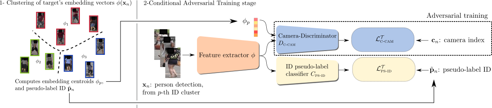

# ICPR2020 (Oral) CANU-MMT: A Conditional Adversarial Network for Unsupervised person Re-IDentification for MMT 


This is a github portal to the implementation of [CANU-ReID: A Conditional Adversarial Network for Unsupervised person Re-IDentification](https://arxiv.org/abs/1904.01308), ICPR 2020 (Oral),
based on [Mutual Mean-Teaching: Pseudo Label Refinery for Unsupervised Domain Adaptation on Person Re-identification](https://openreview.net/forum?id=rJlnOhVYPS).

#### Please visit https://gitlab.inria.fr/gdelorme/CANU_REID_MMT to the complete code implemented mainly by [Guillaume](https://github.com/ragondyn) and partially by Yihong. Due to licence issues, we currently only release code for CANU-MMT. We will update the code for SSG asap.

**If you like the work, please star the project and cite:**


```
@inproceedings{delorme2021canu,
  title={CANU-ReID: A Conditional Adversarial Network for Unsupervised person Re-IDentification},
  author={Delorme, Guillaume and Xu, Yihong and Lathuili{\`e}re, St{\'e}phane and Horaud, Radu and Alameda-Pineda, Xavier},
  booktitle={International Conference on Pattern Recognition},
  year={2021}
}
```


## Results

Weights are available [here](http://perception.inrialpes.fr/Free_Access_Data/DELORME_ICPR2020/CANU_MMT.zip).
<!-- markdownlint-disable MD033 -->
<table>
    <tr>
        <th rowspan="2">SRC --&gt; TGT</th>
        <th colspan="2">Adaptation by MMT(dbscan)</th>
        <th colspan="2">Adaptation by Adv+MMT</th>
        <th colspan="2">Adaptation by CANU+MMT</th>
    </tr>
    <tr>
        <td>Rank-1</td>
        <td>mAP</td>
        <td>Rank-1</td>
        <td>mAP</td>
        <td>Rank-1</td>
        <td>mAP</td>
    </tr>
    <tr><td>Market1501 --&gt; DukeMTMC</td><td> 80.2</td><td>67.2</td><td>82.6</td><td>70.3</td><td>83.3</td><td>70.3</td></tr>
    <tr><td>DukeMTMC --&gt; Market1501</td><td>91.7</td><td>79.3</td><td>93.6</td><td>82.2</td><td>94.2</td><td>83.0</td></tr>
    <tr><td>Market1501 --&gt; MSMT17 </td><td>51.6</td><td>26.6</td><td>-</td><td>-</td><td>61.7</td><td>34.6</td></tr>
    <tr><td>DukeMTMC --&gt; MSMT17 </td><td>59.0</td><td>32.0</td><td>-</td><td>-</td><td>66.9</td><td>38.3</td></tr>

</table>

## Acknowledgement

Our code is based on [MMT](https://github.com/yxgeee/MMT)
